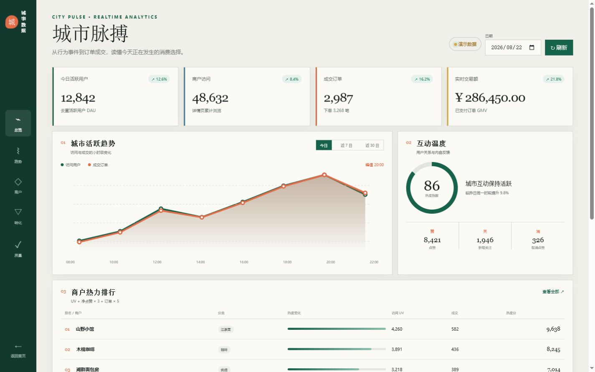

# 黑马点评学习博客（hmdp-learn-blog）

> 一个 Java 后端学习项目的完整学习记录与思考整理。
> 项目从黑马点评课程项目出发，逐步改造出认证、缓存治理、高并发秒杀、异步解耦、链路追踪与实时数仓等能力。本仓库把这些学习记录整理成面向读者的技术博客，每篇都围绕四个问题展开：**为什么要这样做（业务背景）→ 用什么方法解决（方案对比）→ 为什么需要这个技术（原理）→ 不用这个技术怎么办（替代方案与边界）**。

> ⚠️ **诚实声明**：这是个人学习项目，全部功能在本地单机 / Docker Compose 环境验证，不属于生产系统；文中的压测数据均为固定环境实测结果，不代表生产容量。

## ✨ React 前端与实时分析看板

项目已新增 React + Vite 前端，保留 Spring Boot 业务接口，并为数据服务不可用的场景提供演示数据回退。

- **代码分支**：[codex/frontend-analytics-redesign](https://github.com/gdgfd22/hmdp-learn-blog/tree/codex/frontend-analytics-redesign)
- **查看改动 / 合并代码**：[创建 Pull Request](https://github.com/gdgfd22/hmdp-learn-blog/compare/main...codex/frontend-analytics-redesign)
- **页面范围**：城市生活发现首页、小时级活跃趋势、商户热度排行、优惠券转化漏斗与数据质量监控
- **学习代码来源**：[guojianwang/redis](https://gitee.com/guojianwang/redis)，本仓库在其基础上进行了学习实践、功能扩展与文档整理

### 城市生活发现首页

### 实时运营分析看板

## 📚 文章目录

| 序号 | 文章 | 主题 |
|---|---|---|
| 01 | [项目总览：从黑马点评到个人改造的学习项目](articles/01-project-overview.md) | 全项目架构、技术栈、改造路线 |
| 02 | [登录认证：从 Session 到 JWT + Redis 双 Token](articles/02-login-auth-jwt-redis.md) | Session 共享问题、JWT、refreshToken、ThreadLocal |
| 03 | [请求链路追踪：TraceID + MDC + AOP 接口耗时埋点](articles/03-traceid-mdc-aop.md) | 日志串联、MDC 原理、AOP 切面 |
| 04 | [商户缓存治理：穿透、击穿、雪崩与二级缓存](articles/04-cache-penetration-breakdown.md) | Cache Aside、缓存空值、互斥锁、逻辑过期、Caffeine |
| 05 | [业务 ID 生成：为什么不用数据库自增](articles/05-business-id-generator.md) | 雪花思想、Redis 自增、全局唯一趋势递增 ID |
| 06 | [优惠券秒杀：从超卖问题到 Lua + Redisson + 异步削峰](articles/06-seckill-lua-redisson.md) | 超卖、一人一单、Lua 原子校验、分布式锁、异步队列 |
| 07 | [社交模块：Feed 流与 RabbitMQ 异步通知](articles/07-social-notification-rabbitmq.md) | 推模式 Feed、滚动分页、RabbitMQ 通知中心 |
| 08 | [实时数仓：Kafka + Flink + Doris 行为事件链路](articles/08-realtime-warehouse-pipeline.md) | 埋点、Flink CDC、ODS/DWD/DWS/ADS、指标口径、数据质量 |
| 09 | [实时数仓压测与故障恢复](articles/09-realtime-benchmark-recovery.md) | 30s vs 10s Checkpoint、故障演练、MySQL-Doris 对账 |
| 10 | [高频面试问答精选](articles/10-interview-qa-selected.md) | 认证/缓存/秒杀/消息/数仓/Java 八股精选问答 |
| 11 | [MySQL 一条查询的执行流程与 JOIN 复杂度](articles/11-mysql-query-execution.md) | 连接器→存储引擎、INLJ/BNL/Hash Join |
| 12 | [MySQL 索引原理：B+树、聚簇与二级、回表与覆盖、最左前缀与失效](articles/12-mysql-index.md) | 索引树结构、覆盖索引、8 种失效场景 |
| 13 | [MySQL 三大日志：redo/undo/binlog 与两阶段提交](articles/13-mysql-log.md) | WAL、崩溃恢复、主从复制 |
| 14 | [MySQL MVCC：版本链、ReadView 与隔离级别](articles/14-mysql-mvcc.md) | 快照读/当前读、读已提交 vs 可重复读 |

## 🗺️ 推荐阅读顺序

- **想了解整体**：01 → 02 → 03 → 04 → 06 → 08
- **备战面试**：10 为主，配合 02/04/06/08 的追问细节
- **关注高并发**：04 → 06 → 07
- **关注实时数仓**：08 → 09

## 🛠️ 项目技术栈

- **业务侧**：Spring Boot 2.3、MySQL、Redis、Caffeine、Redisson、RabbitMQ、Spring Kafka、MyBatis-Plus、Hutool
- **分析侧**：Kafka 3.8.1、Flink 1.20.1、Flink CDC 3.4.0、Flink Doris Connector 25.1.0、Doris 2.1.9
- **部署环境**：Docker Compose（本地学习环境）

## ⚖️ 内容说明

- 所有文章由个人学习记录整理而来，来源笔记包括项目梳理、秒杀问题专项、面试精简回答与实时数仓文档。
- 文中代码片段为学习实现，可能经过精简以突出重点。
- 欢迎通过 Issues / PR 指正内容错误或补充更好的方案讨论。
