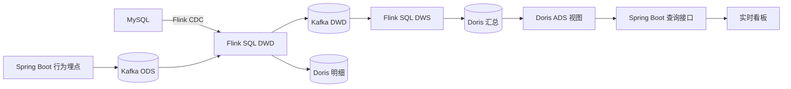

# 实时数仓实战：Kafka + Flink CDC + Flink SQL + Doris 的行为事件分析链路

> 摘要：运营看板需要近实时看到商户热度、优惠券漏斗、留存等指标，而直接在 MySQL 上做持续多维聚合会干扰交易读写。本文记录我在黑马点评个人学习项目旁新增的实时分析模块：行为事件由 Spring Boot 埋点直写 Kafka，订单与券主数据由 Flink CDC 采集，Flink SQL 在 DWD 层校验去重、在 DWS 层按自然日聚合，Doris 承载明细与汇总，ADS 视图组合指标供看板查询。整条链路在单机 Docker Compose 环境验证，本文只陈述已实现的事实与已声明的边界，不把学习环境外推为生产容量。

## 一、为什么要这样做（业务背景与痛点）

点评业务不仅要完成交易，还需要运营侧及时看到商户热度、内容排行和优惠券转化。原始系统中这些指标没有近实时的出口，如果直接在 MySQL 上做持续多维聚合、排行榜查询，会产生三个问题。

第一，**负载耦合**。MySQL 主要服务认证、秒杀、Feed 等高并发事务读写，多维聚合和排行查询往往要扫描大量明细，SQL 一旦不收敛就会抢走 OLTP 的资源，交易接口的延迟和稳定性都会受影响。

第二，**数据形态不匹配**。浏览、点赞、曝光这类行为天然是事件，量大且未必需要进入业务表，为了统计把它们逐条落库既增加写压力，又抬高延迟；而订单是核心交易事实，必须先由 MySQL 事务保证正确，再向外分发状态变化。

第三，**口径无法演进**。PV/UV、漏斗、留存这些指标若散落在各处查询里，清洗规则、公共口径和展示逻辑会互相耦合，指标定义变了要改很多处 SQL，出了问题也难以逐层定位。

不解决会怎样：看板 SQL 干扰业务库、指标口径混乱、行为数据无法回放重算、运营只能看到明显滞后的数字。因此我在业务系统之外增加了一套独立的实时分析模块：**业务系统产生事实，分析链路异步消费，不参与核心事务**。

## 二、用什么方法解决（方案对比）

### 1. 行为数据：直写 Kafka，还是先落库再 CDC？

| 方案 | 优点 | 缺点 |
|---|---|---|
| 行为直写 Kafka | 延迟低；避免给 MySQL 增加写压力；天然是事件流，可回放 | 丢失风险要靠生产端配置兜底；没有事务语义 |
| 先落业务表再 CDC | 有事务、可回溯 | 写放大；分析延迟叠加；行为本就不需要进业务库 |

浏览、曝光、点赞等行为天然是事件，未必都需要先落业务表，本项目选择**直接写 Kafka**：埋点发布器按 userId 优先、其次 deviceId、最后 eventId 作为消息 Key。订单则相反——它是核心业务事实，必须先由事务保证正确，所以以 MySQL 为事实源，再通过 **Flink CDC** 捕获变更。

### 2. 数据库变更：CDC 还是定时全量？

| 方案 | 优点 | 缺点 |
|---|---|---|
| Flink CDC（binlog） | 准实时；增量采集；首次快照与增量衔接 | 依赖 MySQL row 格式 binlog 与复制账号权限 |
| 定时全量扫描 | 实现简单 | 延迟高；周期性全量读对业务库压力大 |

项目选择 CDC。MySQL CDC 账号需要 `SELECT、RELOAD、SHOW DATABASES、REPLICATION SLAVE、REPLICATION CLIENT` 权限，作业以 `initial` 模式启动：先读存量快照，再持续消费 binlog。

### 3. 实时计算：Flink SQL 还是 DataStream API？

当前任务以过滤、去重、分组聚合和结果写出为主，关系表达清晰，**Flink SQL** 开发成本更低，也便于查看执行计划；复杂自定义状态、异步 I/O、精细定时器等 SQL 难以表达的场景才适合 DataStream API。选型依据是问题表达，不是 SQL 一定比代码快。

### 4. 存储：Doris、MySQL 看板还是 ClickHouse？

| 方案 | 优点 | 缺点 |
|---|---|---|
| MySQL 直接做看板 | 组件少 | 多维聚合持续占用 OLTP 资源；更新模型弱 |
| ClickHouse | 追加写与分析性能强 | 更新模型、分布式表设计与运维方式不同 |
| Doris（Unique Key MOW） | 按业务主键覆盖最新值；列式分析；Flink Doris Connector 成熟 | 多一个组件 |

本项目需要 CDC 结果和聚合结果**按键更新**，Doris Unique Key Merge-on-Write 正好契合，且看板查询层与业务库物理隔离。最终选型为 Kafka + Flink SQL + Flink CDC + Doris，版本固定为 Kafka 3.8.1（KRaft 单节点）、Flink 1.20.1、Flink CDC 3.4.0、Doris 2.1.9（单 FE + 单 BE）、MySQL 8.0.36，来自同一兼容区间。

## 三、为什么需要这个技术（原理深入）

### 1. Flink CDC：快照与 binlog 怎样衔接

MySQL CDC 首次启动读取存量快照，同时记录一致的 binlog 位点；快照完成后从对应位置继续消费增量，避免快照期间的更新被遗漏。CDC 把 INSERT、UPDATE、DELETE 转成 **Flink Changelog**——主键表的更新会以撤回旧值、加入新值或 upsert 的语义向下游传播，聚合算子据此对旧贡献撤回、对新贡献累加。`PRIMARY KEY NOT ENFORCED` 告诉 Planner 该字段在数据语义上是主键，但 Flink 不检查唯一性，正确性由上游保证；主键信息让 Upsert Kafka 和 Doris Sink 能识别同一业务记录的更新。订单与券 CDC 还要配置独立 `server-id` 范围，因为 MySQL 把 CDC Reader 当作复制客户端，同一实例上 server-id 不能冲突。

### 2. DWD：校验、去重与脏数据分流

DWD 对行为事件做字段校验（事件 ID、类型、用户标识、业务 ID、时间），并按 `event_id` 去重：

```sql
SELECT *
FROM (
  SELECT t.*,
         ROW_NUMBER() OVER (PARTITION BY event_id ORDER BY event_ts) AS rn
  FROM normalized_behavior t
) WHERE rn = 1;
```

`event_id` 由应用生成 UUID；Doris 明细表再以 `event_id` 为 Unique Key，形成"计算层去重 + 存储层幂等更新"两层保护。流式去重会占用状态，因此设置状态 TTL（DWD 2 天、DWS 8 天，按处理时间清理空闲状态）。非法事件不冒充正常指标，写入 `dirty_behavior_event` 并带错误原因，质量结果按分钟写入 `ads_data_quality`。

### 3. 中间层：为什么 DWD 用 Upsert Kafka

订单 CDC 和去重后的行为数据不是纯追加流，同一主键会发生更新。Upsert Kafka 以业务主键作为消息 Key，新值覆盖旧值，null 值（tombstone）表达删除，让下游看到持续变化的最新表状态（示意片段）：

```sql
CREATE TABLE dwd_behavior (
  event_id STRING,
  event_type STRING,
  user_key STRING,
  event_ts TIMESTAMP(3),
  ...
  PRIMARY KEY (event_id) NOT ENFORCED
) WITH (
  'connector' = 'upsert-kafka',
  'key.format' = 'json',
  'value.format' = 'json',
  'properties.auto.offset.reset' = 'earliest'
);
```

普通 Kafka Source 使用 `scan.startup.mode = group-offsets`，无已提交位点时由 `auto.offset.reset = earliest` 兜底，避免重复提交作业时固定从 earliest 反复回放全部历史。

### 4. 时间语义与 Watermark

项目用 Event Time 归属统计日期，并保存 Event、Ingest、Process 三类时间用于分析延迟。ODS 行为表设置 Watermark 为 `event_ts - 10 秒`，表示允许一定程度的乱序：

```sql
WATERMARK FOR event_ts AS event_ts - INTERVAL '10' SECOND
```

注意：当前主要 DWS 是**持续更新的日累计分组**，不是一个靠 Watermark 关闭的滚动窗口，不能把 Watermark 的作用夸大成所有聚合都依赖它触发。

### 5. Checkpoint 与 Doris 2PC

核心 DWD、DWS 作业每 10 秒做一次 Exactly-Once Checkpoint（超时 5 分钟、最小暂停 3 秒、同时只允许一个 Checkpoint），状态后端为 RocksDB，Kafka 消费位点与算子状态一起保存。Doris Sink 开启 2PC：Checkpoint 期间先预提交本批数据，Checkpoint 成功后才提交对应 Doris 事务，把外部写入与 Flink 状态快照对齐；Doris Unique Key 还能让同一业务主键的重复写表现为覆盖更新。恢复时必须从最新 Checkpoint/Savepoint 启动，Checkpoint 保存在共享 Docker Volume，删除 Volume 后不再具备原来的恢复语义。

### 6. 分层语义与完整链路

ODS 尽量保留原始数据（Kafka 行为 Topic + MySQL CDC 变更）；DWD 做字段标准化、合法性校验、去重、脏数据分流；DWS 按主题维护日粒度聚合（平台/用户/商户/博客/券/订单日汇总，粒度即表 Unique Key）；ADS 用 Doris 视图组合指标，只面向看板。这样 DWD 可被多个下游复用，DWS 统一公共口径，ADS 只做轻量组合，问题也能按层定位。



### 7. 指标口径

金额全部用"分"，避免浮点误差。GMV 是存在支付时间的订单 `pay_amount` 之和，退款金额单独汇总为 `refund_amount`，不直接从 GMV 中扣除（净收入应另定义 `net_gmv = gmv - refund_amount`）。PV 是事件次数，UV 按 `user_key` 去重（登录用户 `u:userId`，匿名设备 `d:deviceId`，避免数字 ID 与设备字符串冲突），DAU 是当天产生有效行为的独立用户数。漏斗按"日期 + 券 + 商户"关联行为与订单主题：曝光 → 秒杀请求 → 实际订单 → 已支付订单，请求率/下单率/支付率分母为 0 时返回 0。**秒杀 `ACCEPTED` 只表示 Lua 校验通过并进入异步队列，最终成功以 MySQL 实际订单为准**，看板同时展示 acceptedCount 和 orderCount。留存先找每个用户首次活跃日形成 cohort，再检查第 1 天、第 7 天是否回访。商户热度 = 访问 UV + 净点赞数 ×3 + 订单数 ×5，博客热度 = 浏览 UV + 净点赞数 ×3——权重是可解释的演示规则，不是行业标准公式。

## 四、不用这个技术怎么办（替代方案与当前边界）

每个关键点都有替代方案，但都有代价：

- **行为改落库再 CDC**：延迟叠加、写放大，行为本就不需要事务；
- **CDC 改定时全量**：从增量退化为周期全量扫描，延迟高且周期性冲击业务库；
- **Flink SQL 改 DataStream**：代码量和维护成本上升，当前任务没有非用不可的自定义状态；
- **Doris 改 MySQL 看板**：OLTP 与 OLAP 负载重新耦合；**改 ClickHouse**：更新模型和运维方式不同，与 CDC 按键更新链路的配合成本更高。

当前实现的边界（诚实口径：个人学习项目，单机 Docker Compose 验证）：

- 基础设施单节点：Kafka 单 Broker、副本数 1，Flink 单 JobManager + 单 TaskManager，Doris 单 FE + 单 BE，桶数只有 1 或 3，不能抵御节点级故障，不能作为生产部署方案；
- 并行度 2 是本地演示配置，不是容量规划结果；
- 精确去重（`COUNT(DISTINCT user_key)`）在大基数下状态成本高，规模扩大后应考虑 HyperLogLog、分桶去重或两阶段聚合；
- 状态 TTL（DWD 2 天、DWS 8 天）是演示取值，TTL 到期后非常晚到的重复事件可能重新进入计算；
- 券 CDC 当前主要做质量校验，没有完整参与主 DWD 维度关联；DWS 全量历史重放不在已验证范围；
- 身份未做匿名设备与登录用户的合并，同一自然人可能被计成两个用户；事件没有独立 schemaVersion，也没有 Schema Registry；
- 压测脚本直接写 Kafka，不包含 Spring Boot HTTP 链路；埋点与 Doris 查询默认关闭，需显式开启。

生产环境如何升级：先补多 Broker 与副本、Flink HA（多 JobManager/TaskManager）、Doris 多副本与合理的日期分区/分桶；再按峰值压测确定分区数与并行度；为高基数 UV 引入近似去重；补 Schema Registry 与事件契约、Outbox 可靠投递、分钟级窗口与迟到回补；最后加 Prometheus/Grafana 监控告警与指标版本管理。

## 小结

- 行为是事件、订单是事实：行为直写 Kafka 降低延迟与 MySQL 压力，订单以 MySQL 为源走 Flink CDC，两类数据在 DWD 汇合。
- 分层解决口径耦合：ODS 保留原始、DWD 校验去重分流、DWS 按主题聚合、ADS 组合展示，问题可逐层定位。
- 更新流是核心难点：订单状态会变化，因此用 Upsert Kafka、Flink Changelog、Doris Unique Key MOW 传递"撤回旧值、写入新值"。
- Checkpoint + Doris 2PC 把外部写入与状态快照对齐，Unique Key 作为恢复重放时的幂等兜底。
- 指标口径必须显式定义：分单位金额、UV 的 user_key 前缀、漏斗的 accepted 与 order 分开、退款单独汇总。
- 边界同样重要：单节点、并行度 2、精确去重状态成本、TTL 取舍、DWS 重放未验证——这些都要在介绍时主动说明。
