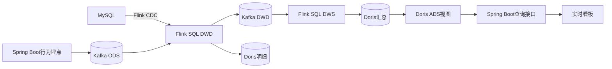

# 点评平台用户行为实时分析模块

本目录是一套独立于 Java 8业务应用的本地实时数仓环境。业务库变更通过 Flink CDC采集，访问、曝光、点赞、关注和秒杀请求由 Spring Boot直接写入 Kafka；Flink SQL完成清洗、去重、质量检测和实时聚合，Doris提供明细、汇总及 ADS视图查询。

## 数据链路



## 固定版本

- Kafka 3.8.1，KRaft单节点
- Flink 1.20.1，Java 11运行时
- Flink CDC 3.4.0
- Flink Doris Connector 25.1.0
- Doris 2.1.9，单 FE + 单 BE
- MySQL 8.0.36

这些版本来自同一兼容区间。不要随意只升级某一个连接器；升级前重新核对 Flink CDC和 Doris Connector兼容矩阵。

## 启动

建议 Docker Desktop分配至少 12 GB内存。本 Compose为学习、演示和故障演练环境，单副本数据不能作为生产部署方案。

```powershell
cd realtime-warehouse
Copy-Item .env.example .env
docker compose up -d --build
docker compose ps
```

首次启动 Doris可能需要几分钟。确认 `kafka-init` 和 `doris-init` 以退出码 0结束后提交 Flink作业：

```powershell
.\scripts\submit-jobs.ps1
```

启动业务应用时启用分析事件和 Doris查询，并指向 Compose映射端口：

```powershell
$env:MYSQL_PORT="3307"
$env:ANALYTICS_EVENTS_ENABLED="true"
$env:ANALYTICS_QUERY_ENABLED="true"
$env:KAFKA_BOOTSTRAP_SERVERS="127.0.0.1:9092"
mvn spring-boot:run
```

入口：

- Flink Web UI：<http://localhost:18081>
- Doris FE：<http://localhost:8030>
- RabbitMQ：<http://localhost:15672>
- 实时看板：<http://localhost/analytics.html>

如果复用本机已有 MySQL，需要先执行 `mysql/V2__analytics_order_snapshot.sql`，并为 Flink CDC账号授予 `SELECT、RELOAD、SHOW DATABASES、REPLICATION SLAVE、REPLICATION CLIENT`权限。

## 分层和指标

ODS为 Kafka的 `ods_behavior_event` 以及 MySQL CDC源；DWD负责事件校验、按 `event_id` 去重、订单状态校验和脏数据分流；DWS持续维护日粒度聚合；ADS使用 Doris视图组合指标。

当前实现：

- DAU、商户访问 PV/UV
- 点赞、取消点赞、关注、取消关注趋势
- 优惠券曝光、秒杀请求、受理、订单、支付漏斗
- 秒杀最终成功率、订单数、GMV、退款金额
- 热门商户和热门博客排行
- 用户首次活跃 cohort的次日/7日留存
- 非法事件、订单金额和状态一致性检查

金额全部使用“分”。秒杀 `ACCEPTED`只表示 Lua校验通过并进入异步队列；最终成功以 MySQL实际订单记录为准。

## 数据质量与恢复验证

无效行为写入 `dirty_behavior_event`，每分钟错误量和样例写入 `ads_data_quality`。订单规则包括：

- 状态必须为 1—6
- 金额不得为负
- 实付加优惠不得大于券面快照
- 退款不得大于实付
- 已支付、已核销或退款状态必须存在支付时间
- 已退款状态必须存在退款时间

查看 Kafka积压、Flink任务和 Doris BE状态：

```powershell
.\scripts\check-health.ps1
```

抽样对账：

```powershell
.\scripts\reconcile.ps1 -Date "2026-07-22"
```

故障恢复演练：

1. 持续生成事件。
2. 在 Flink UI确认最近一次 Checkpoint成功。
3. `docker compose kill flink-taskmanager`。
4. `docker compose up -d flink-taskmanager`。
5. 确认作业恢复、Kafka Lag回落且 Doris没有重复主键。
6. 再执行 MySQL与 Doris对账。

Checkpoint保存在共享 Docker Volume，Doris Sink启用 2PC。恢复时必须从最新 Checkpoint或 Savepoint启动；删除 Volume后不再具备原来的恢复语义。

## 压测记录

生成模拟行为事件：

```powershell
.\scripts\generate-events.ps1 -Count 100000 -UserCount 5000 -ShopCount 14
```

脚本输出只是生产端生成耗时，不是链路延迟。正式记录以下实测项：

- 输入事件数和持续时间
- Kafka各分区最大 Lag
- Flink吞吐、忙碌/空闲/背压时间
- Checkpoint持续时间、大小、失败次数
- `Doris可见时间 - event_time` 的 P50、P95和最大值
- 故障恢复耗时与恢复后对账差异

没有实际记录前，不要在简历中填写数据量、性能提升比例或毫秒级延迟。
